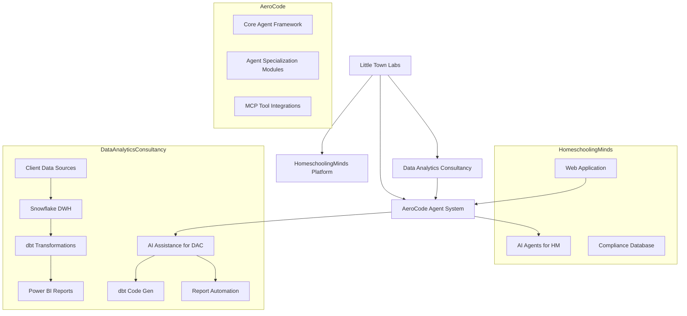

# System Patterns

## System Architecture Overview

Little Town Labs operates on a multi-product architecture with AeroCode serving as a foundational AI agent development system that supports and integrates with other product lines.

**Key Architectural Principles:**
*   **Modularity:** AeroCode provides reusable AI components. HomeschoolingMinds and the Data Analytics Consultancy are distinct service offerings.
*   **Scalability:** Cloud-native solutions (e.g., Snowflake for DAC) and a scalable agent framework (AeroCode) are prioritized.
*   **AI-Assisted Development:** AeroCode is leveraged to accelerate development and automate tasks within both HomeschoolingMinds and the Data Analytics Consultancy.
*   **API-Driven:** Interactions between systems and with external services are primarily API-based.

## Key Technical Decisions & Rationale

**1. AeroCode as a Foundational AI Layer:**
    *   **Decision:** Develop AeroCode as a central AI agent system rather than building bespoke AI for each product.
    *   **Rationale:** Promotes reusability, standardization, and accelerates development of AI features across all Little Town Labs initiatives. Allows for focused expertise in agent development.

**2. HomeschoolingMinds Technology Stack:**
    *   **Decision:** (To be detailed - likely web platform technologies, specific database for compliance).
    *   **Rationale:** (To be detailed based on platform needs - e.g., user management, web interface, secure data storage).

**3. Data Analytics Consultancy Technology Stack:**
    *   **Decision:** Standardize on Snowflake (Data Warehouse), dbt (Transformation), and Power BI (Visualization).
    *   **Rationale:**
        *   **Snowflake:** Highly scalable, cloud-native, strong API support, robust security, and governance features suitable for enterprise clients.
        *   **dbt:** Enables SQL-based transformations, version control (Git-based workflow ideal for AI assistance), automated testing, and documentation, promoting data quality and transparency.
        *   **Power BI:** Strong integration with the Microsoft ecosystem (common in enterprises), familiar interface for business users, good governance, and sharing capabilities.
    *   **AI Integration:** This stack is well-suited for AI-assisted development via AeroCode, particularly for dbt model generation and Power BI automation.

## Design Patterns in Use

*   **AeroCode:**
    *   **Agent-Based Architecture:** Core pattern for structuring AI capabilities.
    *   **Modular Design:** Agents and their components are designed as reusable modules.
    *   **(Potentially) Microservices:** For deploying and scaling individual agent capabilities.
*   **HomeschoolingMinds:**
    *   **(To be detailed - likely MVC/MVVM for web app, potentially event-driven for AI interactions).**
*   **Data Analytics Consultancy:**
    *   **ELT (Extract, Load, Transform):** Standard data warehousing pattern, with dbt handling the "T".
    *   **DataOps Principles:** Emphasizing automation, version control, and testing in data workflows (facilitated by dbt).
    *   **Template-Driven Development:** Reusable dbt models and Power BI templates to accelerate client onboarding.

## Component Relationships

*   **AeroCode & HomeschoolingMinds:** AeroCode provides specialized AI agents (e.g., for educational guidance, compliance checking) that are integrated into the HomeschoolingMinds platform via APIs.
*   **AeroCode & Data Analytics Consultancy:**
    *   AeroCode agents assist in the consultancy workflow by:
        *   Generating boilerplate dbt models from client requirements.
        *   Automating aspects of Power BI report creation or data refresh.
        *   Potentially analyzing client data for initial insights.
    *   The consultancy leverages AeroCode's MCP integrations for these tasks.
*   **Data Analytics Consultancy Components:**
    *   Client Data Sources -> (Ingestion) -> Snowflake (Raw/Staging)
    *   Snowflake (Raw/Staging) -> dbt (Transformation) -> Snowflake (Transformed/Modeled)
    *   Snowflake (Transformed/Modeled) -> Power BI Service (Visualization & Reporting)

## Critical Implementation Paths

*   **AeroCode Core Framework:** The stability and flexibility of the AeroCode agent framework are critical as it underpins other services.
*   **HomeschoolingMinds Compliance Engine:** Ensuring accuracy and up-to-date compliance logic for target states.
*   **Data Analytics Consultancy - First Client Onboarding:** Successfully implementing the end-to-end data pipeline (Snowflake, dbt, Power BI) with AI assistance for an initial client will be a critical validation point.
*   **Secure and Efficient Data Handling:** Across all products, particularly for sensitive educational data (HomeschoolingMinds) and enterprise client data (Consultancy).

---

*This document outlines the foundational technical structure and patterns of the project.*